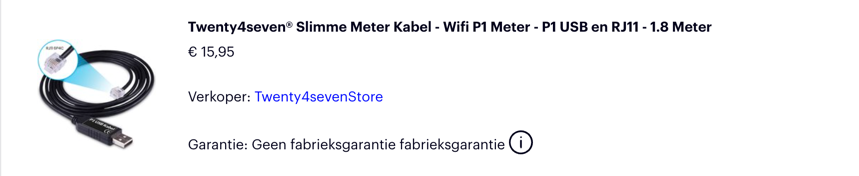

# digital_meter
Digital Meter Application for Belgian e-Meters

Todo in the next days:
- add quarter peak


## Installation

The application is written in Python and to ensure that the application runs in a controlled environment, it is recommended to use a virtual environment. The following steps describe how to install the application on a Raspberry Pi.

```bash
python3 -m venv .venv
source .venv/bin/activate
pip install -r requirements.txt
```

To autostart at boot, add the following line to the crontab of the user pi:

```bash
sudo crontab -e -u pi
```

then add this line at the end of the file:

```bash
@reboot /home/pi/digital_meter/startup_cron.sh &
```

The application is started by the script `startup_cron.sh` which is located in the root of the project. 
The script activates the virtual environment and starts the application.

## Customisation

The rates used in the application are example the rates for a Belgian utility provider. 
To change the rates, edit the file `rates.json` in the root of the project. 
The file contains the rates for the different periods of the day for electricity, gas and water.

```json
{
  "Gas": {"+": 0.5},
  "Water": {"+": 0.5},
  "Electricity": {"+": {"Day": 0.4, "Night": 0.3},
                  "-": {"Day": 0.1, "Night": 0.1}}
}
```

## Running the application - tmux

The application is started in a tmux environment, which allows to run the application in the background and to view the application on another terminal.
To view the application on another terminal, login (f.e. through ssh), then run the following command:

```bash
tmux a
```

To detach from the tmux environment, press `Ctrl+b` followed by `d`.
Some other keys to use in tmux:
- `Ctrl+b` followed by `c` to create a new window
- `Ctrl+b` followed by `n` to switch to the next window
- `Ctrl+b` followed by `p` to switch to the previous window
- `Ctrl+b` followed by `&` to close the current window
- `Ctrl+b` followed by `[` to start scrolling mode
- `Ctrl+b` followed by `]` to paste copied text
- `Ctrl+b` followed by `?` to get help
- `Ctrl+b` followed by `:` to enter a command
- `Ctrl+b` followed by `x` to close the current pane


## Connection to the meter

- USB to TTL Serial Cable - Debug / Console Cable for Raspberry Pi

The connection to the meter is done through a USB to TTL Serial Cable. The cable is connected to the meter and to the Raspberry Pi. 
The Raspberry Pi is connected to the internet through a network cable or through WiFi.



serial_port = '/dev/ttyUSB0' by default.

Should the cable be connected to another port, you can find the port by running the following command:

```bash
ls /dev/ttyUSB*
```

Should you need to change it, edit the file `digital_meter.py` in the root of the project.

Is the cable too short, you can use a shielded USB extension cable as speed is a fast 100k baud.