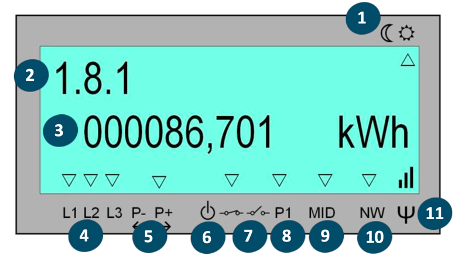
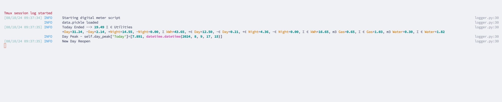
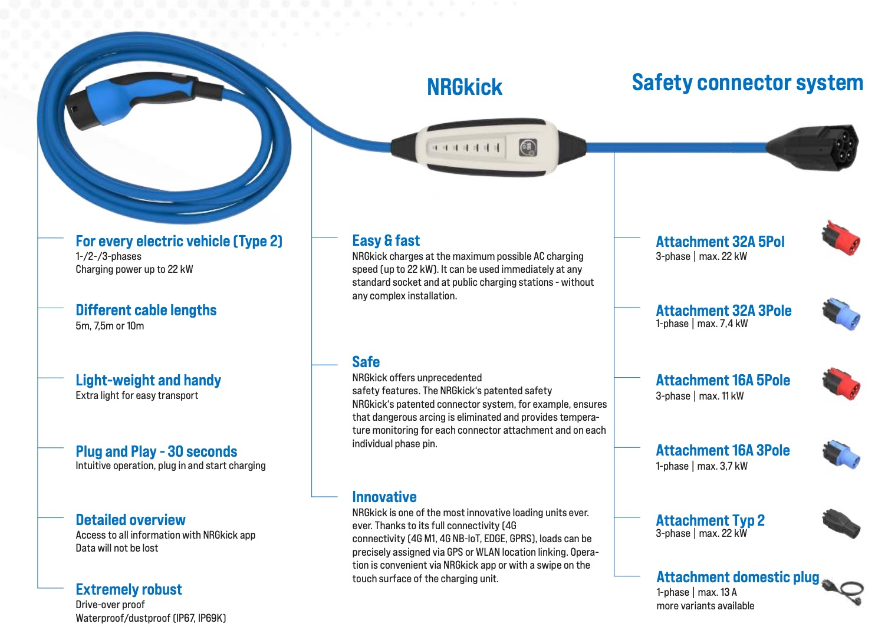
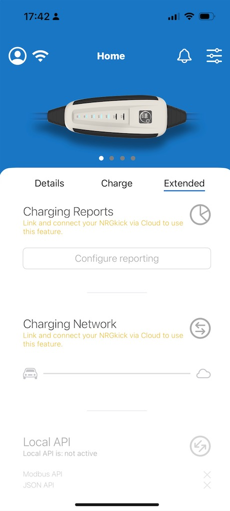

# Digital_meter with Energy Management Apps

Digital Meter Application for Belgian e-Meters.

Is a standalone application that reads the digital meter and calculates the cost of electricity, gas and water based on the rates in the file `rates.json`.

2 satellite applications are included:
- an electrical vehicle management application
- a battery storage management application

They all communicate with the digital meter application through a websocket server and client.
They can run therefore on the same raspberry pi or on different machines.

For Electrical Vehicle Management, NRGKick is used to manage the power consumption of the electrical vehicle.
NRGKick is a mobile charging station that can be controlled through a mobile app and through a web interface.

# Digital Meter Application

## check if your P1 port is working

You need to request fluvius to activate the P1 port on your meter via myfluvius.be.

Check the screen output of the meter to see if the P1 port is active:



An arrow has to appear above P1 (indicated by 8), then the port is active and opened.

It streams the data every second on high serial speed on the port P1 (below the yellow cover). 

## Connection to the meter

- USB to TTL Serial Cable - Debug / Console Cable for Raspberry Pi

The connection to the meter is done through a USB to TTL Serial Cable. The cable is connected to the meter and to the Raspberry Pi. 
The Raspberry Pi is connected to the internet through a network cable or through WiFi.


serial_port = '/dev/ttyUSB0' by default.

Should the cable be connected to another port, you can find the port by running the following command:

```bash
ls /dev/ttyUSB*
```

Should you need to change it, edit the file `config.py` in the root of the project.

Is the cable too short, you must use a shielded USB extension cable as speed is a fast 100k baud.

# Screen Output


The screen output are panels created by rich and updated every second. 

The panels are as follows:
1. The top panel shows the current date and time as received from the meter.
2. The Rate panel left shows the active rates for electricity, gas and water in magenta, the inactive rates in cyan.
3. Below the Usage panel the consumption and cost for electricity, gas and water, highlighted green for the active rate for a few days in the past and for day, week, month and year period.
4. The Monthly Peak panel shows the month peak power for electricity as reported by the meter, current and past.
5. The left bottom panel Quarters Peak shows the current quarter peak power for electricity as reported by the meter, and the forecasted peak power for the quarter against the month peak power, highlighted in red if a new monthly peak is in the make.  
6. Finally, The right side panel Telegram shows the last processed meter telegram contents.

The Quarters Peak panel is important for energy management.
The gap is the amount of power that can be used before the peak power is reached OR the amount the current quarter risks to overshoot the current month peak.
This is crucial input for managing energy storage and consumption.
The quarter progress is highlighted in a red bar.   

Another tmux session is created with the logging output of the application:




# Electrical Vehicle Charging Application

As example is created for the management of an electrical vehicle with a NRGKick charging station.
The NRGKick charging station is connected to the electrical vehicle and to the electrical installation by standard connectors making this a very flexible setup.

The vehicle charging strategy of the ev_app is as follows:
- charge the vehicle quickly when the charge is less than 20% to ensure the vehicle is ready for an emergency trip
- retrieve the upcoming trip and required charge from the calendar and determine charge tactics
- charge the electrical vehicle when excess electricity is produced as indicated by the digital meter
- or when rates are lowest (rate = 2 night)
- and stay below the peak capacity of the current month
- but ensures the car fully charged when needed for an upcoming trip
- with multiple cars, manage the resources to ensure all cars are charged when needed

This is different from the NRGKick app or other energy management solutions that charges the vehicle with all generated solar power.

Maybe half is consumed by the house and therefore only the other half is available to charge the vehicle.

Trips are retrieved from the Google Calendar API, and the car is charged to the required level before the trip.
Car use in the calendar is indicated by the word @car_x@ in the title of the event with car_x the name of the car in the config.py file.




For the ev_app to work, one must request to enable the json NRGKick API by NRGKick.
The NRGKick API is a json API that allows to control the NRGKick charging station.



If the Local API is not enabled, the ev_app will not work.
See therefore the NRG Kick app, select Extended and press the Local API button.
This allows to enroll for the lastest firmware and to enable the Local API, but at time of writing, this can take up to 17 days!


# Management of Energy Storage

Energy storage through batteries allows us to store energy when it is cheap and use it when it is expensive. 
Vehicle to Grid (V2G) can be used to store energy in your electric vehicle and use it when needed and act as a battery.

This occurs in the following 3 situations in Belgium:
- Your solar production is higher than your consumption, and you want to store the excess energy to use yourself.
- You can leverage the difference between the day and night rate for electricity.
- Peak power use can be reduced by using stored energy.

In case spot prices are used, the application can be extended to use the lowest spot prices to charge the batteries and the highest spot prices to discharge the batteries.

This "brokering" can be done by a smart energy contract. 

Specific for Belgium, installing a battery has consequences:
- you have to do an attestation of your installation after you update the schematics of your electrical installation
- you can only use a certified battery
- you have to limit the power output of the battery to 10kW for 3 phases and 5kW for 1 phase
- and you have to announce the installation on myfluvius.be 
- and your energy supplier has put your meter in "meetregime 3" (frequent metering) and you might have to pay a fee for this, then get dynamic pricing enabled.


Most batteries are not certified for Belgium, so you have to check with the manufacturer if the battery is certified for Belgium.

And most suppliers come with their own energy management system, not adapted for the spot pricing and peak capacity in Belgium.

# Interaction and collaboration between the apps

Energy optimisation is a complex task and requires the collaboration between the different applications to meet the operational and financial requirements of the user.
Resources are constrained and have to be managed between the different applications.

## How they are talking?

Each app has a websocket server and client to stream to receive commands or to forward the data.

## What are they talking to each other?

- The digital meter application informs the other apps from the current/expected rates, current usage and peak gap or overshoot.
- The ev_app determines charging needs and tactics (how long charging at what rate) and takes a cut from the digital meter available power bandwidth.
- Should there be a short fall in power, the ev_app can request the battery for help.
- The bs_app will manage the battery to store energy when it is cheap and use it when it is expensive, and to reduce the peak power use.

Settings happen on the spot, therefore the apps have to be able to react quickly to the changing rates, usage and peak power.
Should the house consumption suddenly increase or clouds hinder solar production, the ev_app has to reduce the charging rate or stop charging, or get more help from the battery.
Equally, when a car is needed for a sudden trip, the ev_app has to ensure the car is fully charged, when the trip starts, ignoring rate and peak power optimisations. 

A cloud application could be more powerful as it could include weather prediction patterns, but the latency is high for the quick reactions needed in energy management.


# Installation

Warning: the installation is not for the fainted of hart, as it requires some knowledge of the raspberry pi and linux.

Personally, an ansible script to install the application on a raspberry pi (or on Apple Mac or Ubuntu) can simplify and make the installation repeatable.
Alternatively a docker setup.

The terminal manager TMUX need to be setup, as the application is started in a tmux environment, which allows to run the application in the background and have terminal views and windows created by the application viewable on another terminal.

Anyway, the following steps describe how to install the application on a Raspberry Pi.

The application is written in Python and to ensure that the application runs in a controlled environment, it is recommended to use a virtual environment. The following steps describe how to install the application on a Raspberry Pi.

Visit the github page of pyenv and follow the instructions to install pyenv-virtualenv on your raspberry pi and install the shell extension.

https://github.com/pyenv/pyenv-virtualenv

as example, the following commands should be executed:

```bash
curl https://pyenv.run | bash
export PATH="/home/pi/.pyenv/bin:$PATH"
echo -e "\nexport PATH=\"~/.pyenv/bin:$PATH\""
echo -e "eval \"$(pyenv init -)\"\neval \"$(pyenv virtualenv-init -)\"\n" >>./.bashrc
exec "$SHELL"
pyenv install 3.12.2
pyenv virtualenv 3.12.2 digital_meter
mkdir digital_meter
cd digital_meter
pyenv local digital_meter
```


After successful installation the follow lines should add to your .bashrc file in the home directory of the user pi:

```bash
export PYENV_ROOT="/home/pi/.pyenv" 
export PATH="$PYENV_ROOT/bin:$PATH" 
eval "$(pyenv init -)" 
eval "$(pyenv virtualenv-init -)"
```

Reboot and ensure you enter the virtual environment when you visit the digital_meter directory.

Now install the required python imports:

```bash
pip install -r requirements.txt
```

To autostart at boot, add the following line to the crontab of the user pi:

```bash
sudo crontab -e -u pi
```

select nano as editor, then add this line at the end of the file:

```bash
@reboot /home/pi/digital_meter/startup_cron.sh
```

Finish with `Ctrl+x`, `y` and `enter`.

The application is started by the script `startup_cron.sh` which is located in the root of the project. 
The script activates the virtual environment and starts the different applications each in a tmux session.

Should you want to show the output to a display connected to your raspberry pi at boot? 

First activate automatic login:

```bash
sudo raspi-config
```

Then go to System Options -> Boot / Auto Login -> Command Autologin

Then edit your .profile file in the home directory of the user pi:

```bash
sudo nano /home/pi/.profile
```

and add the following lines at the end of the file:

```bash
# added script
cd $HOME/digital_meter
# Check if the session exists, discarding output
# We can check $? for the exit status (zero for success, non-zero for failure)
tmux has-session -t dm 2>/dev/null
if [ $? != 0 ]; then
    tmux new-session -ds dm
fi
# Attach to created session
tmux a -t dm
```

Finish with `Ctrl+x`, `y` and `enter`.

When you reboot the raspberry pi, the application will start automatically in the tmux window "dm" and you can view the output on the display.
if you log out, the application will automatically login and bring you back.

The application is started in a tmux environment, which allows to run the application in the background and to view the application on another terminal.
To view the application on another terminal, login (f.e. through ssh), then run the following command:

```bash
tmux a -t dm

or to attach to the electrical vehicle management application:

tmux a -t ev 

or to attach to the battery storage management application:

tmux a -t bs 

or to attach to the logging output of the application:

tmux a -t log
```

or alternatively use Ctrl+b followed by '(' or ')' to switch between the different tmux panes, where the log pane becomes also visible.

To detach from the tmux environment, press `Ctrl+b` followed by `d`.
Some other keys to use in tmux:
- `Ctrl+b` followed by `c` to create a new window
- `Ctrl+b` followed by `n` to switch to the next window
- `Ctrl+b` followed by `p` to switch to the previous window
- `Ctrl+b` followed by `&` to close the current window
- `Ctrl+b` followed by `[` to start scrolling mode
- `Ctrl+b` followed by `]` to paste copied text
- `Ctrl+b` followed by `?` to get help
- `Ctrl+b` followed by `:` to enter a command
- `Ctrl+b` followed by `x` to close the current pane
- `Ctrl+b` followed by `(` to visit the previous pane -> previous app 
- `Ctrl+b` followed by `)` to visit the next pane -> next app
- `Ctrl+b` followed by `d` to detach from the tmux environment

The application will continue when you detach from the tmux environment, but you will not see the output.
The application will stop when you close the current pane.

## Running the application - manual

To run the application manually, activate the virtual environment and run the application.

```bash 
./do_py.sh dm.py
```

## Remotely Accessing the application

To view the application on another terminal, login (f.e. through ssh), then run the following command:

```bash
tmux a -t dm
```
  
or attach to another tmux pane as explained before.

## Customisation

The rates used in the application are example the rates for a Belgian utility provider. 
To change the rates, edit the file `rates.json` in the root of the project. 
The file contains the rates for the different periods of the day for electricity, gas and water.


```json
{
  "Gas": {"+": 1.576, "cnv": ["kWh", 11.510]},
  "Water": {"+": 6.1},
  "Electricity": {"+": {"Day": 0.4, "Night": 0.3},
                  "-": {"Day": 0.1, "Night": 0.1}}
}
```

## Websocket Server and Client

Each application has a websocket server and client to stream to receive commands or to forward the data.
The server is started by the application and listens on the port as specified in socket_info.

One can install a socket client on another machine to receive / test the responses from the application.

Configure a remote machine to receive the data by installing the websockets package, and making sure the ip address and port are correcty specified in socket_info.

In the current application, the socket_info is specified in the config.py file in the root of the project and the programming is bespoke in my_socket.py.

Make the socket_info empty in config.py to disable the socket server and client.

```bash
python -m websockets  ws://PI-DM:8080/ws
```

Anything you type will be sent to the server and the server will respond with the data.

## log, history and pickle files

The application writes a log file (log_info.log) in the log directory with debug, info and error traces.

At the end of each day, the application writes a json file with usage, cost and the logfile to the history directory, overwriting the files with the same date_prefix one year earlier.

No cleaning is needed as only 365 * 2 files are kept.

Object and data for cost calculation are stored in a pickle file in the root of the project.

If you need to start fresh or changed objects, delete the pickle file, it will also happen if the pickle file is corrupted.

## Authors

* **Rudy Vandenberghe** - *Initial work* - [rudyvan]

# License

This project is licensed under the MIT License - see the [LICENSE](LICENSE) file for details.

