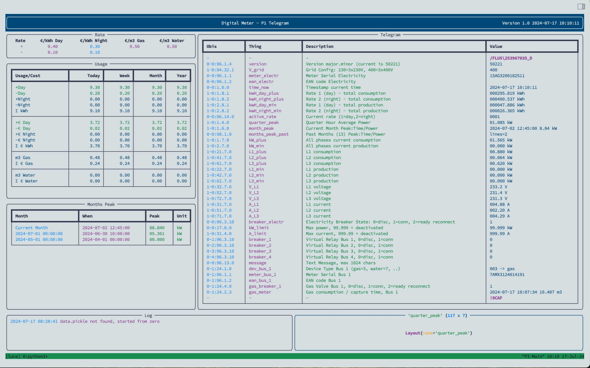

# digital_meter
Digital Meter Application for Belgian e-Meters

Todo in the next days:
- split in modules
- add installation
- add quarter peak
- add import of data.json at startup
- update readme




sudo crontab -e -u pi

```bash
MAILTO="lucy_home_control@outlook.com"
#Ansible: start startup_cron.sh script at reboot
@reboot /home/pi/digital_meter/startup_cron.sh &
```

python3 -m venv .venv
source .venv/bin/activate
pip install -r requirements.txt