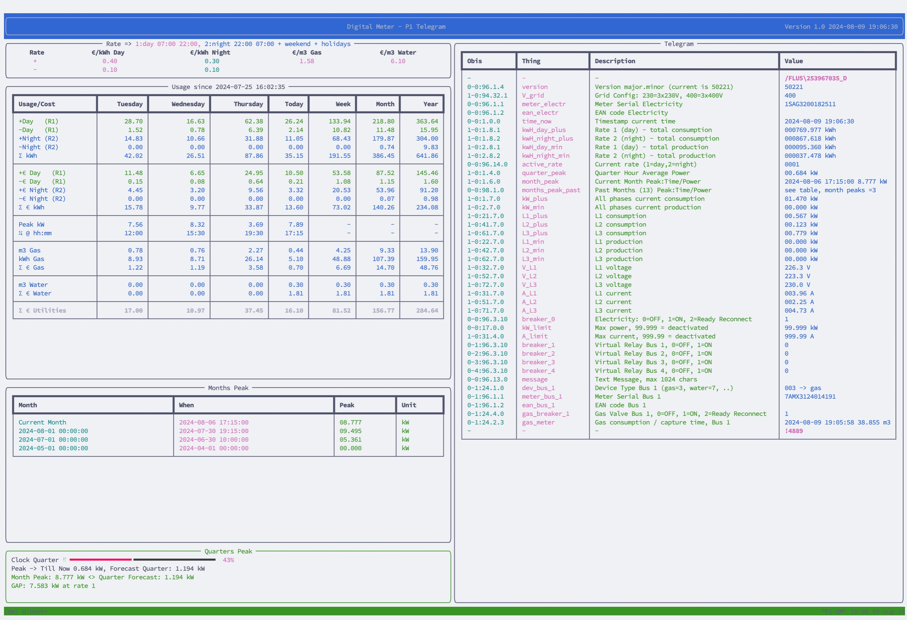

# Digital_meter with Energy Management Apps

Digital Meter Application for Belgian e-Meters.
Is a standalone application that reads the digital meter and calculates the cost of electricity, gas and water based on the rates in the file `rates.json`.

2 satellite applications are included:
- an electrical vehicle management application
- a battery storage management application

They all communicate with the digital meter application through a websocket server and client.
They can run therefore on the same raspberry pi or on different machines.

For Electrical Vehicle Management, NRGKick is used to manage the power consumption of the electrical vehicle.
NRGKick is a mobile charging station that can be controlled through a mobile app and through a web interface.

## check if your P1 port is working

You need to request fluvius to activate the P1 port on your meter via myfluvius.be.
check the screen output of the meter to see if the P1 port is active:


An arrow has to appear above P1 (indicated by 8), then the port is active and openend.
It streams the data every second on high serial speed on the port P1 (below the yellow cover). 

## Connection to the meter

- USB to TTL Serial Cable - Debug / Console Cable for Raspberry Pi

The connection to the meter is done through a USB to TTL Serial Cable. The cable is connected to the meter and to the Raspberry Pi. 
The Raspberry Pi is connected to the internet through a network cable or through WiFi.


serial_port = '/dev/ttyUSB0' by default.

Should the cable be connected to another port, you can find the port by running the following command:

```bash
ls /dev/ttyUSB*
```

Should you need to change it, edit the file `dm.py` in the root of the project.

Is the cable too short, you can use a shielded USB extension cable as speed is a fast 100k baud.

# Screen Output



The screen output are panels created by rich and updated every second. 

The panels are as follows:
1. The top panel shows the current date and time as received from the meter.
2. That panel shows the active rates for electricity, gas and water in magenta, the inactive rates in cyan.
3. Shows the current consumption and cost for electricity, gas and water, highlighted green for the active rate.
4. The panel shows the month peak power for electricity as reported by the meter, current and past.
5. The log panel shows the 10 most recent logging messages
6. The side panel shows the last processed meter telegram contents.
7. The right bottom panel shows the current quarter peak power for electricity as reported by the meter, and the forecasted peak power for the quarter against the month peak power.  

The gap is the amount of power that can be used before the peak power is reached OR the amount the current quarter risks to overshoot the current month peak.
Then the whole quarter is highlighted in red.   
This is crucial input for an energy storage management system.


# Management with Energy Storage

Energy storage through batteries allows us to store energy when it is cheap and use it when it is expensive. 
Vehicle to Grid (V2G) can be used to store energy in your electric vehicle and use it when needed and act as a battery.

This occurs in the following 3 situations in Belgium:
- Your solar production is higher than your consumption, and you want to store the excess energy to use yourself.
- You can leverage the difference between the day and night rate for electricity.
- Peak power use can be reduced by using stored energy.

In case spot prices are used, the application can be extended to use the lowest spot prices to charge the batteries and the highest spot prices to discharge the batteries.
This "brokering" can be done by a smart energy contract. 

Specific for Belgium, installing a battery has consequences:
- you have to do an attestation of your installation after you update the schematics of your electrical installation
- you can only use a certified battery
- you have to limit the power output of the battery to 10kW for 3 phases and 5kW for 1 phase
- and you have to announce the installation on myfluvius.be 


Most batteries are not certified for Belgium, so you have to check with the manufacturer if the battery is certified for Belgium.

And most suppliers come with their own energy management system, not adapted for the spot pricing and peak capacity in Belgium.

## Installation

The application is written in Python and to ensure that the application runs in a controlled environment, it is recommended to use a virtual environment. The following steps describe how to install the application on a Raspberry Pi.

```bash
python -m venv .venv
source .venv/bin/activate
pip install -r requirements.txt
```

To autostart at boot, add the following line to the crontab of the user pi:

```bash
sudo crontab -e -u pi
```

select nano as editor, then add this line at the end of the file:

```bash
@reboot /home/pi/digital_meter/startup_cron.sh
```

Finish with `Ctrl+x`, `y` and `enter`.

The application is started by the script `startup_cron.sh` which is located in the root of the project. 
The script activates the virtual environment and starts the different applications each in a tmux session.

Should you want to show the output to a display connected to your raspberry pi at boot? 

First activate automatic login:

```bash
sudo raspi-config
```

Then go to System Options -> Boot / Auto Login -> Command Autologin

Then edit your .profile file in the home directory of the user pi:

```bash
sudo nano /home/pi/.profile
```

and add the following line at the end of the file:

```bash
sleep 5s
tmux a -t dm
```

Finish with `Ctrl+x`, `y` and `enter`.

When you reboot the raspberry pi, the application will start automatically in the tmux window "dm" and you can view the output on the display.
if you logout, the application will automatically login and bring you back.

The application is started in a tmux environment, which allows to run the application in the background and to view the application on another terminal.
To view the application on another terminal, login (f.e. through ssh), then run the following command:

```bash
tmux a -t dm

or to attach to the electrical vehicle management application:

tmux a -t ev 

or to attach to the battery storage management application:

tmux a -t bs 
```

To detach from the tmux environment, press `Ctrl+b` followed by `d`.
Some other keys to use in tmux:
- `Ctrl+b` followed by `c` to create a new window
- `Ctrl+b` followed by `n` to switch to the next window
- `Ctrl+b` followed by `p` to switch to the previous window
- `Ctrl+b` followed by `&` to close the current window
- `Ctrl+b` followed by `[` to start scrolling mode
- `Ctrl+b` followed by `]` to paste copied text
- `Ctrl+b` followed by `?` to get help
- `Ctrl+b` followed by `:` to enter a command
- `Ctrl+b` followed by `x` to close the current pane
- `Ctrl+b` followed by `d` to detach from the tmux environment

The application will continue when you detach from the tmux environment, but you will not see the output.
The application will stop when you close the current pane.

## Running the application - manual

To run the application manually, activate the virtual environment and run the application.

```bash 
source .venv/bin/activate
python dm.py
```

## Remotely Accessing the application

To view the application on another terminal, login (f.e. through ssh), then run the following command:

```bash
tmux a -t dm
```
  
or attach to another tmux pane as explained before.

## Customisation

The rates used in the application are example the rates for a Belgian utility provider. 
To change the rates, edit the file `rates.json` in the root of the project. 
The file contains the rates for the different periods of the day for electricity, gas and water.

```json
{
  "Gas": {"+": 0.5, "cnv":  ["kWh", 11.510]},
  "Water": {"+": 0.5},
  "Electricity": {"+": {"Day": 0.4, "Night": 0.3},
                  "-": {"Day": 0.1, "Night": 0.1}}
}
```

## Websocket Server and Client

Each application has a websocket server and client to stream to receive commands or to forward the data.
The server is started by the application and listens on the port as specified in socket_info.

One can install a socket client on another machine to receive / test the responses from the application.

Configure a remote machine to receive the data by installing the websockets package, and making sure the ip address and port are correcty specified in socket_info.

Then run the following command to start the websocket client:  
(PI-DM is the hostname of the raspberry pi)

```bash
python -m websockets  ws://PI-DM:8080/ws
```

Anything you type will be sent to the server and the server will respond with the data.
With "?" you can request the current data, with "!" you can request the current rates.

## Electrical Vehicle Management

As example is created for the management of an electrical vehicle with a NRGKick charging station.
The NRGKick charging station is connected to the electrical vehicle and to the electrical installation by standard connectors making this a very flexible setup.


For the ev_app to work, one must request to enable the json NRGKick API by NRGKick.
The NRGKick API is a json API that allows to control the NRGKick charging station.


If the Local API is not enabled, the ev_app will not work.
See therefore the NRG Kick app, select Extended and press the Local API button.
This allows to enroll for the lastest firmware and to enable the Local API, but at time of writing, this can take up to 17 days!

The strategy of the ev_app is as follows:
- charge the electrical vehicle when excess electricity is produced as indicated by the digital meter
- or when rates are 2 (night)
- and stay below the peak capacity of the current month
- but ensures the car fully charged when needed for an upcoming trip

This is different from the NRGKick app or other energy management solutions that charges the vehicle with all generated solar power.
Maybe half is consumed by the house and therefore only the other half is available to charge the vehicle.

Trips are retrieved from the Google Calendar API, and the car is charged to the required level before the trip.
Car use in the calendar is indicated by the word @car_x@ in the title of the event with car_x the name of the car in the config.py file.


## Authors

* **Rudy Vandenberghe** - *Initial work* - [rudyvan]

# License

This project is licensed under the MIT License - see the [LICENSE](LICENSE) file for details.

